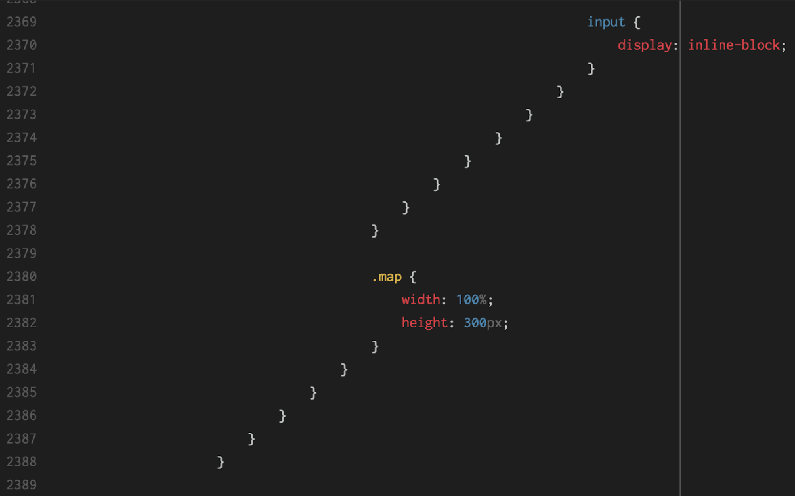

export { default as theme } from './theme'
import { FullScreenCode } from 'mdx-deck/layouts'
import { Head } from 'mdx-deck'
import { Appear } from 'mdx-deck'
import { Image } from 'mdx-deck'
import { Invert } from 'mdx-deck/layouts'

<Head>
  <title>The bumpy road to a maintainable, scalable CSS</title>
</Head>


---
according to most neuroscience studies, people's number one fear is **public speaking**.

number two is **death**.
```notes
Esto significa dos cosas:

1) La primera, que en un entierro la gente prefiere estar en el ataúd que dando el réquiem
2) La segunda, que estoy venciendo a la muerte.
```
---
<Image src="images/death.png" />
---
# The bumpy road to a maintainable, scalable CSS
From the trenches

---
# Adrià Fontcuberta
SW Engineer at Calidae

@afontcu_
---
# Adrià Fontcuberta
Frontend Dev at Calidae

@afontcu_
---
# Adrià Fontcuberta
UI Engineer at Calidae

@afontcu_
---
# Adrià Fontcuberta
Webmaster at Calidae

@afontcu_
---
<Image src="/images/sponsors.png" />
---
what happened with CSS?
---
CSS Zen Garden happened
---
<Image src='images/css-zen-garden.png' />
---

---
```css
.sidebar .design-selection nav ul li a {
  display: inline;
}
```
```notes
(es gracios perque els links son display inline per defecte)

Para hacerlo, evidentmente, necesitamos estilos como este. (explicar-lo)

Vale, perfect, ningun problema. CSS se hace así. Y así lo hicimos
```
---
<Image src='images/css-for-babies.png' />
---
"HTML is entirely decoupled from the CSS!"

"Separation of Concerns! wow amaze engineers!"
---
separation of _what_?
---
HTML to create a layout

CSS to style it
---
<Image src="images/remove-the-product.png" />
---
```jsx
<div class="remove-product">
  <h1>Remove the product</h1>
  <div>
    
    <p>This action cannot be undone.</p>
  </div>
  <div>
    <button class="remove">Yes</button>
    <button>Cancel</button>
  </div>
</div>
```
---
```scss
.remove-product {
  > h1 { ... }
  > div {
      img { ... }
      p { ... }
    }
  > div {
    > button {
      &.remove { ... }
    }
  }
}
```

```notes
Y este sería el CSS resultante.
```
---
lol separation of concerns.

```notes
es como que jugabamos a ser ingenieros de software
```
---
Don't Repeat Yourself (DRY)

Single Responsibility Principle (SRP)

Principle of Least Astonishment (POLA)

```notes
Esto sabiamos que existia, pero que mas da? 

Quieres ver un buen Principle of Least Astonishment?
```
---
```css
.qbutton.green {
  background-color: turquoise;
}
```
---
```css
.home.column a.product.class300 {
  width: 300px;
  margin-left: 20px;
}
```
```css
.home.column a.product.class400 {
  width: 450px; /* WTF */
  margin-left: 60px;
}
```
---
<Image src="images/css-meme.jpg" />

```notes
in software enginneering, we've always known what is "good" and "wrong".
in css we didn't.

y ademas le añadiamos Scss. Eramos como cabras locas.

Habeis visto nunca una cabra loca? Yo tampoco pero tiene que ser la leche,
porque si ya parece que estan locas cuando no lo estan... en fin.
```
---

---
```css
body.product .content-body-wrapper.tabs-block .switch 
.offer  section.accommodation .content-width 
.accommodation .select-accommodation-box .list .map {   
  width: 100%; height: 300px; }

body.product .content-body-wrapper.tabs-block .switch .offer 
section.accommodation .content-width .accommodation 
.select-accommodation-box  .list .list-content .items 
.accommodation-info #formAccomodation 
.accommodation-form .mealplan .select-price input {
  display: inline-block; }
```
---
<Image src='images/inception.png' />
---
export default Invert

> The worst part about front-end development was that the other people solving your problems were front-end developers.

[Adam Morse](http://mrmrs.cc/writing/2016/03/24/scalable-css/)

```notes
Por suerte, gente muy inteligente ha estado pensando en como escalar nuestras
interfícies, y en concreto cuál es la relación entre este objetivo y CSS.
```
---
Visual CSS
---
```jsx
<div class="remove-product">
  <h1>Remove the product</h1>
  <div>
    
    <p>This action cannot be undone.</p>
  </div>
  <div>
    <button class="remove">Yes</button>
    <button>Cancel</button>
  </div>
</div>
```

```notes
buenas intenciones sí teníamos. al fin y al cabo, queriamos separar responsabilidades,
lo que no lo conseguimos del todo.

al final nos dimos cuenta que lo que queriamos era poder reutilizar el CSS.

teniamos la sensacion de estar escribiendo uuuna y otra vez las mismas cosas
pero con nombres distintos (incluso entre proyectos).
```
---
content-semantic class names is not a good idea.

(if you want to reuse your CSS)

```notes
Cuando juegas con Legos no piensas "ah, mira una pieza que forma parte de la
pared de la habitación que estoy construyendo".

Piensas: "ah mira, una 2x2 gris claro". Puedes hacer lo que quieras con ella.

No puedes reutilizar el propósito de una pieza si este propósito está ligado
al contenido. 
```
---
from this...

```jsx
<div class="remove-product">
  <h1>Remove the product</h1>
  <div>
    
    <p>This action cannot be undone.</p>
  </div>
  <div>
    <button class="remove">Yes</button>
    <button>Cancel</button>
  </div>
</div>
```

```notes
Primer paso para desacoplar: usar clases como hooks en lugar de puros elementos.
Conseguimos un primer punto de libertad: No dependemos del markup exacto.
```
---

...to this
```jsx
<div class="modal">
  <h1 class="modal-title">...</h1>
  <div class="modal-body">
    
    <p class="modal-message">...</p>
  </div>
  <div class="modal-buttons">
    <button class="btn primary">Yes</buttom>
    <button class="btn">Cancel</buttom>
  </div>
</div>
```

```notes
Vale, han pasado un monton de cosas.

1. lo mas visible: hay un monton de clases. Por que? porque asi nos liberamos
de la estructura concreta de HTML. Usamos clases como "hook" para estilos, no elementos.

2. ahora hemos llamado a nuestro elemento "modal". Ojo que esto es mas importante
de lo que parece. "modal" no habla del propósito de nuestro codigo (de hecho, 
con este ejemplo no sabes para qué va a servir el modal. y eso es bueno). habla
de como luce, del aspecto de nuestro elemento. 

Por eso lo llamamos "Visual CSS"

Y puede parecer suuuuper evidente a dia de hoy, mas que nada porque este es el
approach de la mayoria de frameworks (Boostrap, UIkit, etc). Pero no lo era 
hace un tiempo, y nos habiamos dado bastantes hostias contra la pared por eso.
```
---
but you are repeating yourself. in HTML.

you and your "software principles".

```notes
Si claro, en alguna parte vas a tener que repetirte.

Llegamos a la conclusión que en alguna parte vas a acabar repitiéndote, quieras
o no. Pero como queremos conseguir algo reusable, lo ideal seria repetirse en
HTML, y así poder reaprovechar el CSS en diferentes proyectos.
```
---
what if...
---
<Image src="images/modal-alert.png" />
---
```scss
.modal-messages {
  .modal-icon { ... }
  .modal-message { ... }
}

.alert-content {
  .alert-img { ... }
  .alert-text { ... }
}
```

```notes
Volvemos a estar en las mismas. Es el mismo elemento? Podemos seguir reduciento
nuestros bloques?
```
---
Single Responsibility Principle in CSS
---
```scss
.text-with-icon {}
```
---
```scss
.icon-text {}
```
```notes
No estabamos inventando nada nuevo. 

La metáfora concreta de "icon-text" o cómo quieras llamarlo ya existía
```
---
export default Invert

> The **media object** is an image to the left, with descriptive content to the right.

[Nicole Sullivan](http://www.stubbornella.org/content/2010/06/25/the-media-object-saves-hundreds-of-lines-of-code/)

```notes
Nicole Sullivan es la creadora del concepto OOCSS, Object-oriented CSS.
```
---

---
<Image src="images/media-object-facebook.png" />
---
<Image src="images/modal-alert.png" />
---
```jsx
<div class="modal">
  <h1 class="modal-title">...</h1>
  <div class="modal-body">
    
    <p class="modal-message">...</p>
  </div>
  <div class="modal-buttons">
    <button class="btn primary">Yes</buttom>
    <button class="btn">Cancel</buttom>
  </div>
</div>
```
---
```jsx
<div class="modal">
  <h1 class="modal-title">...</h1>
  <div class="media">
    
    <p class="media-body">...</p>
  </div>
  <div class="modal-buttons">
    <button class="btn primary">Yes</buttom>
    <button class="btn">Cancel</buttom>
  </div>
</div>
```

```notes
Aqui vemos tambien algo interesante. Este alert que enseñábamos antes
esta formado por un media y por las propias clases del alert.

Software Principle: prefer Composition over Inheritance.
```
---
```jsx
<div class="media alert">
  
  <p class="media-body alert-content">Changes saved successfully</p>
</div>
```
---
our building blocks (css classes) were now reusable across projects.

```notes
En nuestro contexto, es lo máximo a lo que podemos aspirar. Agencia digital
con varios proyectos, diferentes necesidades, contextos, equipos...
```
---
a modal? nah.
---
a component made of components.

**modal** = media + button + card + ...

```notes
Nos dimos cuenta de algo importante. Hacia falta que estos componentes pequeños
tuvieran consistencia entre ellos. Además, habia cambiado como veíamos nuestras
aplicaciones.
```
---
we were not building pages anymore.

we were building components of a system.
---
from **styling pages** to creating **design systems**.
---
SENIOR DESIGN SYSTEM ENGINEER

```notes
Esto lo pones en LinkedIn y tienes que ir a vivirte a una isla desierta para
que dejen de llegarte mensajes. Y aun así.
```
---
# Design systems

Rules

Constraints

Principles
---
**Rules**: Spacing values must be proportional.

**Constraints**: Only 5 spacing values available.

**Principles**: Spacing should help establish relationship between elementos.
---
```scss
$baseline: 6px;
```

```scss
$unit-factor-tiny:   1;
$unit-factor-small:  2;
$unit-factor:        4;
$unit-factor-large:  8;
$unit-factor-huge:  16;
```
---
results in

```scss
$global-spacing-unit-tiny  =  $baseline * $unit-factor-tiny;  // 6px
$global-spacing-unit-small =  $baseline * $unit-factor-small; // 12px
$global-spacing-unit       =  $baseline * $unit-factor;       // 24px
$global-spacing-unit-large =  $baseline * $unit-factor-large; // 48px
$global-spacing-unit-huge  =  $baseline * $unit-factor-huge;  // 96px
```

```notes
Funcionaria exactamente igual usando javascript.

Tendríamos nuestro theme.js o lo que sea, y allí crearíamos los valores
válidos para nuestro sistema.

Software Principle: Magic Numbers
```
---
styles based on systems became harmonious.
---
```scss
$global-font-sizes: (
  h1: 32px,
  h2: 28px,
  h3: 24px,
  h4: 20px,
  h5: 18px,
  h6: 16px
);
```
---
```scss
$global-colors: (
  "branding-primary": #fabada,
  "branding-secondary": #c0ffee,
);
```

```notes
Esto ya lo podiamos haber hecho antes, con el CSS semántico. Seguramente si.
Pero es una evolucion, porque en ese momento ni se nos ocurrió que esto pudiera
tener algún valor. 
```
---
we had the right pieces.

components as building blocks, using constraints, rules, and principles.
---
we were ENGINEERING OUR UI.
---
what about **naming**?

what about **file structure**?
---
# ITCSS + BEM
Inverted Triangle CSS (by [Harry Roberts](https://www.creativebloq.com/web-design/manage-large-css-projects-itcss-101517528))

Block Element Modifier (by Yandex)
---
## Why "inverted triangle"?

from global to local.

from generic to concrete.

from low specificity to high specificity.
---
<Image src="images/itcss.png" />
---
```bash
1-Settings/
    _colors.scss
2-Tools/
    _mixins.scss
3-Base/
    _normalize.scss
4-Generic/
    _image.scss
5-Objects/
    _media.scss
6-Components/
    _modal.scss
7-Utilities/
    _hidden.scss
```
---
/scss/1-Settings/_core.scss

```scss
$baseline: 6px;

$unit-factor-tiny:   1;
$unit-factor-small:  2;
$unit-factor:        4;
$unit-factor-large:  8;
$unit-factor-huge:  16;
```
---
/scss/1-Settings/_font-sizing.scss

```scss
$global-font-sizes: (
  h1: 32px,
  h2: 28px,
  h3: 24px,
  h4: 20px,
  h5: 18px,
  h6: 16px
);
```
---
/scss/6-Components/_modal.scss

```scss
.modal {
  ...
}

.modal-buttons {
  ...
}
```
---
you get the idea.
---
there are 2 hard problems in computer science: cache invalidation, naming things, and off-by-1 errors.
---
# BEM (Block - Element - Modifier)

how to name things?

```notes
por ejemplo, un Media Object tiene varias partes. La imagen, el body.
Como lo identificamos?

Podríamos crear tres clases (media, image y body) pero es evidente los problemas
que nos podemos encontrar con eso, no?

Necesitabamos una nomenclatura que nos permitiera establecer las relaciones
Y EL ENCAPSULAMIENTO que no nos ofrece el lenguaje out of the box (de momento).
```
---
```css
.block {}

.block__element {}

.block--modifier {}
```
```scss
.block__element--modifier {}
```
---
```css
.person {}

.person__eyes {}

.person--tall {}
```
```scss
.person__eyes--blue {}
```
---
# Namespaces

Objects (.o-)

Components (.c-)

Utilities (.u-)
---
/scss/5-Objects/_objects.media.scss

```scss
.o-media { display: flex; align-items: flex-start; }

.o-media__body { flex: 1; }

.o-media__image { margin-right: $global-spacing-unit; }

.o-media--large .o-media__image { margin-right: $global-spacing-unit-large; }
```

```notes
Esta es nuestra "forma final", como escribimos CSS ahora mismo cuando tenemos
que crear un componente. Es algo diferente si usamos estos principios sobre
un framework JS (no namespaces en componentes).
```
---
it looks weird.

```notes
pero con el tiempo BEM te seduce, con su coherencia y su forma de encapsular 
las clases.
```
---

---
what if...
---
death by repetition

```scss
.o-media--large {
  margin-right: $global-spacing-unit-large; }
```
```scss
.c-list_item--large {
  margin-right: $global-spacing-unit-large; }
```
```scss
.c-header--spaced {
  margin-right: $global-spacing-unit-large; }
```

```notes
Observamos que nos pasaba esto. Creábamos modifiers usando el SRP, pero no
podiamos evitar repetirnos. Teniamos decenas de clases haciendo exactamente
lo mismo, era el naming y nuestras convenciones lo que nos impedía reaprovechar
```
---
death by modifiers
```jsx
<nav class="c-nav c-nav--large c-nav--primary-color c-nav--boxed
            c-nav--rounded c-nav--full-width">
    <ul class="c-nav__list u-nav__list--unpadded
               c-nav__list--spaced-bottom">
      <li class="c-nav__item c-nav__item--boxed c-nav__item--black
                 c-nav__item--padded-bottom c-nav__item--huge">
      </li>
    </ul>
</nav>
```

```notes
es casi como si un niño pequeño hubiera dado cabezazos a un teclado, o como si
un alemán borracho hubiera decidido crear un nuevo idioma a partir de la ruleta
de la suerte.

Y si empezamos creando elementos con utilidades, y creamos los componentes
cuando los vamos necesitando, y no antes?
```
---
```scss
.u-margin-right-large {
  margin-right: $global-spacing-unit-large !important;
}
```
---
# Utility-first CSS

(not "utility-only")

```notes
"first" significa que empezamos usando los bloques "Legos" más pequeños.

Cuando vemos un patrón que se repite, ese es el momento de crear un componente.

Es exactamente lo mismo que hacemos en React, Vue, Angular, o cualquier framework
o lenguaje para construir aplicaciones.

Así evitamos abstracciones prematuras.
```
---
export default Invert

> The best way of writing great CSS is **to avoid writing CSS**.

Me
---
create a lot of small, reusable, focused CSS classes, and use them to build your UI.
---
<Image src="images/remove-the-product.png" />
---
```jsx
// Modal.js (o Modal.vue, o...)

<div class="c-card">
  <h1 class="c-card__header u-padding u-text-hairline">...</h1>
  <div class="c-card__body">
    <div class="o-media o-media--center u-padding">
      
      <p class="o-media__body u-text-h5 u-text-hairline">...</p>
    </div>
    <div class="u-padding-small u-background-dark-gray
                u-flex u-flex-justify-between">
      <button class="c-btn c-btn--ghost">...</button>
      <button class="c-btn c-btn--primary">...</button>
    </div>
  </div>
</div>
```

```notes
Creamos componentes cuando y donde hace falta.

No cada elemento hijo de modal tiene su clase equivalente. Si no hace falta, 
no la escribimos.
```
---
<Image src="images/wat.gif" />
---
```jsx
// Modal.js (o Modal.vue, o...)

<div class="c-card">
  <h1 class="c-card__header u-padding u-text-hairline">...</h1>
  <div class="c-card__body">
    <div class="o-media o-media--center u-padding">
      
      <p class="o-media__body u-text-h5 u-text-hairline">...</p>
    </div>
    <div class="u-padding-small u-background-dark-gray
                u-flex u-flex-justify-between">
      <button class="c-btn c-btn--ghost">...</button>
      <button class="c-btn c-btn--primary">...</button>
    </div>
  </div>
</div>
```
---
```jsx
<nav className="c-nav u-padding-horizontal u-padding-vertical-tiny
                u-color-primary u-margin-right-large
                u-radius-circle u-width-100">
    <ul class="c-nav__list u-nav__list--unpadded
               c-nav__list--spaced-bottom">
      <li class="c-nav__item c-nav__item--boxed u-color-black
                 u-padding-bottom-small u-margin-left-huge">...</li>
    </ul>
</nav>
```

```notes
Tiene sentido crear el componente "MainNav"? Es la navegación principal. Si tienes
suficiente con las utilidades, para que crear una abstracción de algo que no 
vas a reutilizar?

Supongamos que la clase `c-nav` la hemos añadido porque tenemos un Element
y queremos mantener la coherencia de nuestro naminb (Block > Element).

Solo hay un MainNav en toda la aplicación, tiene sentido crear el componente?
Podemos dejar las utilidades?

Y el componente NavItem? Sólo hay uno...si lo encapsulamos en un componente.

Este es el beneficio principal de utility-first. Abstracciones cuando las
necesitas, no antes.
```
---
```jsx
// Nav.js

<nav className="u-padding-horizontal u-padding-vertical-tiny
                u-color-primary u-margin-right-large
                u-radius-circle u-width-100">
    <ul class="u-padding-small-bottom">
      {items.map(item => <NavItem />)}
    </ul>
</nav>
```
```jsx
// NavItem.js

export default () => (
  <li className="c-nav-item u-padding-bottom-small
                  u-color-black u-margin-left-huge">...</li>
)
```
---
it is possible to build a whole new component without writing 
**a single line of CSS**.
---
"a lot of things happened in 40 minutes"
---
# Normandy CSS
Scss + ITCSS + BEM + Namespaces

[Github link](https://github.com/calidae/normandy-css)
---
# Next steps
---
constraints over conventions.
---
JS + CSS = 💖?

```notes
CSS-in-JS solutions (styled components, spectacle, etc)
```
---
Shadow DOM

```notes
Native solution for the global nature of HTML, CSS and JS.

Scoped CSS: CSS defined inside shadow DOM is scoped to it. Style rules don't
leak out and page styles don't bleed in.

Forget naming conflicts! No need for namespaces! Byebye BEM!
```
---
# (Our) Learnings

<ul>
  <Appear>
    <li>CSS should become our UI building blocks.</li>
    <li>Forget about content-related meaning.</li>
    <li>Use utilities and abstract out components as needed.</li>
    <li>Agree on structure, naming and principles.</li>
    <li>Think in components, not pages.</li>
  </Appear>
</ul>

```notes
Atomic CSS es un buen "approach" para pensar en componentes y olvidar el concepto
de diseñar/programar páginas. Contar con el apoyo del diseñador va a ser bastante
útil, porque este mindset puede cambiar por completo el flujo de trabajo.
```
---
export default Invert

# Thank you ! 
What questions do you have?

(ask me anyting: @afontcu_ on Twitter)
---
# References
  
[CSS and scalability - Adam Morse](http://mrmrs.cc/writing/2016/03/24/scalable-css/) 

[CSS Utility Classes and "Separation of Concerns" - Adam Wathan](https://adamwathan.me/css-utility-classes-and-separation-of-concerns/)

[Functional Programming, CSS, and your sanity - Jon Gold](https://jon.gold/2015/07/functional-css/)

[Immutable CSS - Harry Roberts](https://csswizardry.com/2015/03/immutable-css/)

[Object Oriented CSS - Nicole Sullivan](https://github.com/stubbornella/oocss/wiki)
---
# References
[About HTML semantics and front-end architecture - Nicholas Gallager](http://nicolasgallagher.com/about-html-semantics-front-end-architecture/)

[Shadow DOM: Self-Contained Web Components, Eric Bidelman](https://developers.google.com/web/fundamentals/web-components/shadowdom)

[CSS Modules](https://github.com/css-modules/css-modules)