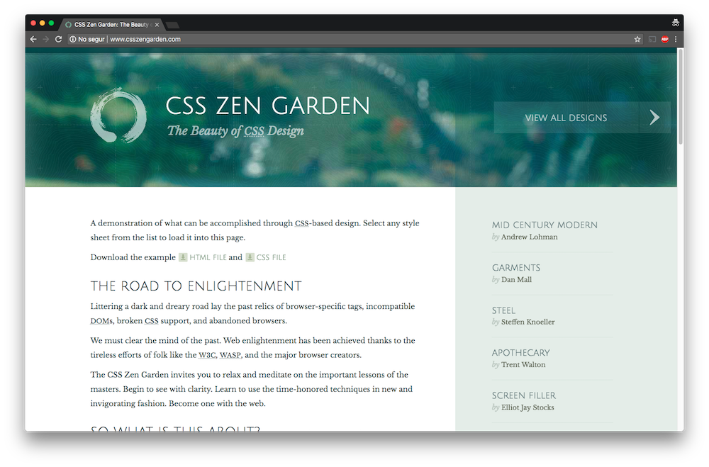
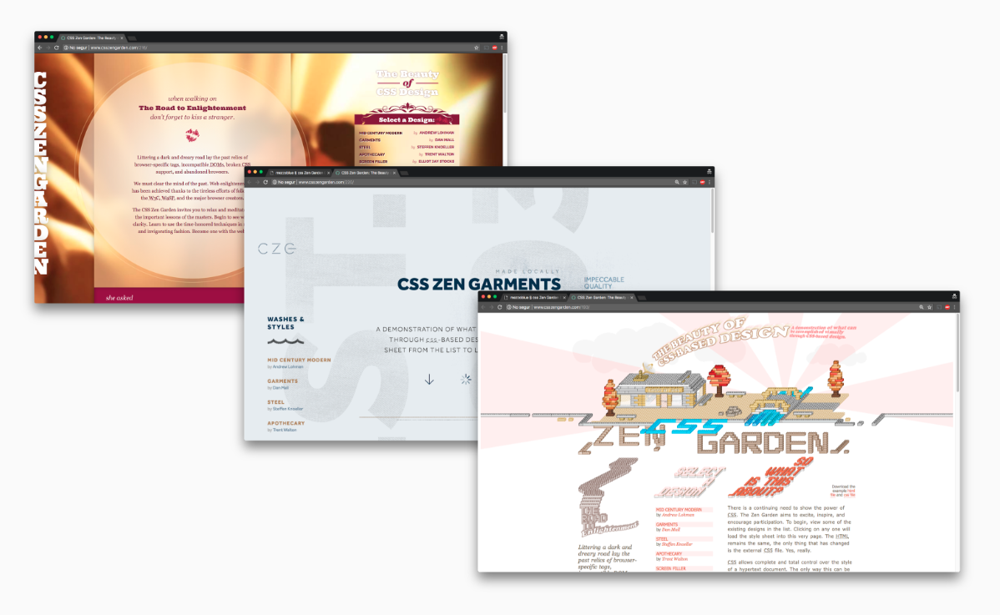
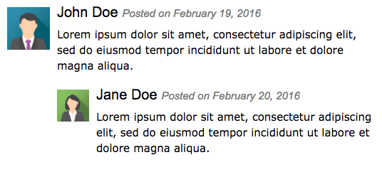

export { default as theme } from './theme'
import { FullScreenCode } from 'mdx-deck/layouts'
import { Head } from 'mdx-deck'
import { Appear } from 'mdx-deck'
import { Image } from 'mdx-deck'
import { Invert } from 'mdx-deck/layouts'

<Head>
  <title>Maintainable, scalable CSS?</title>
</Head>


---
according to most neuroscience studies, people's number one fear is **public speaking**.

number two is **death**.
```notes
Esto significa dos cosas:

1) La primera, que en un entierro la gente prefiere estar en el ataúd que dando el réquiem
2) La segunda, que estoy venciendo a la muerte.
```
---
<Image src="images/death.png" />
---
# Maintainable, scalable CSS
From the trenches

---
# Adrià Fontcuberta
SW Engineer at Calidae

@afontcu_
---
# Adrià Fontcuberta
Frontend Dev at Calidae

@afontcu_
---
# Adrià Fontcuberta
UI Engineer at Calidae

@afontcu_
---
# Adrià Fontcuberta
Webmaster at Calidae

@afontcu_
---
what happened with CSS?
---
it was ~2008.

it all started with CSS Zen Garden.
```notes
Demostraba que podiamos crear miles de versiones de una misma web sin tocar
una sola linea de HTML. Y eso era bueno. Estabamos "separando responsabilidades"
porque esto es lo que hay que hacer, no? Separar responsabilidades.

HTML = contenido y estructura.

CSS = estilo.
```
---

---

---
```css
.sidebar .design-selection nav ul li a {
  display: inline;
}
```
```notes
(es gracios perque els links son display inline per defecte)

Para hacerlo, evidentmente, necesitamos estilos como este. (explicar-lo)

Vale, perfect, ningun problema. CSS se hace así. Y así lo hicimos
```
---
export default Invert

"It is a feature!"
---
export default Invert

"HTML is entirely decoupled from the CSS!"
---
export default Invert

"This is what CSS should look like! We are using <strong>The Cascade™</strong>"
```notes
Estabamos escribiendo CSS bien? No se, por el contexto pareciera que sí.

Estabamos escribiendo CSS reaprovechable? Nah. Nuestro CSS dependía al 100%
de nuestro HTML. Si el objetivo era separar responsabilidades, lo estabamos
haciendo mal.
```
---
we knew about this thing called "Separation of Concerns"
---
HTML for layout

CSS for styles
---

---
# Standard good practices

Don't Repeat Yourself (DRY)

Single Responsibility Principle (SRP)

Principle of Least Astonishment (POLA)

...
```notes
"If a necessary feature has a high astonishment factor, it may be necessary to redesign the feature"

"People are part of the system. The design should match the user's experience, expectations, and mental models."
```
---
POLA (not) in action
```css
.qbutton.green {
  background-color: turquoise;
}
```
---
POLA (not) in action
```css
.home.column a.product.class300 {
  width: 300px;
  margin-left: 20px;
}

.home.column a.product.class400 {
  width: 450px;
  margin-left: 60px;
}
```
---
we didn't quite get them.
---
# Enter Sass

with great power comes great responsibility.
---
what does having great powers with no good practices looks like?
---
<Image src='images/nesting-hell.png' />
---
```css
body.product .content-body-wrapper.tabs-block .switch 
.offer  section.accommodation .content-width 
.accommodation .select-accommodation-box .list .map {   
  width: 100%; height: 300px; }

body.product .content-body-wrapper.tabs-block .switch .offer 
section.accommodation .content-width .accommodation 
.select-accommodation-box  .list .list-content .items 
.accommodation-info #formAccomodation 
.accommodation-form .mealplan .select-price input {
  display: inline-block; }
```
---
<Image src='images/inception.png' />
---
export default Invert

> The worst part about front-end development was that the other people solving your problems were front-end developers

[Adam Morse](http://mrmrs.cc/writing/2016/03/24/scalable-css/)

```notes
Por suerte, gente muy inteligente ha estado pensando en como escalar nuestras
interfícies, y en concreto cuál es la relación entre este objetivo y CSS.
```
---
anyway, principles.
---
we decided this one was cool:

**"Separation of Concerns"**
---
HTML for layout

CSS for styling
---
# Content-semantic classes

_(a.k.a. classes have "meaning")_

```jsx
<div class="remove-modal">
  <h1>Remove the product</h1>
  <div>
    
    <p>This action cannot be undone.</p>
  </div>
  <div>
    <button class="remove">Yes</button>
    <button>Cancel</button>
  </div>
</div>
```
---
wow such meaning
---
<Image src="images/remove-the-product.png" />
---
```jsx
<div class="remove-product-modal">
  <h1>Remove the product</h1>
  <div>
    
    <p>This action cannot be undone.</p>
  </div>
  <div>
    <button class="remove">Yes</button>
    <button>Cancel</button>
  </div>
</div>
```
---
```scss
.remove-product-modal {
  > h1 { ... }
  > div {
      img { ... }
      p { ... }
    }
  > div {
    > button {
      &.remove { ... }
    }
  }
}
```

```notes
.remove-modal?

"Separation of Concerns"? Nuestro CSS está totalmente ligado a nuestro HTML.
No puedes editar uno sin editar el otro.
```
---
content-semantic class names is not a good idea.

```notes
Cuando juegas con Legos no piensas "ah, mira una pieza que forma parte de la
pared de la habitación que estoy construyendo".

Piensas: "ah mira, una 2x2 gris claro". Puedes hacer lo que quieras con ella.

No puedes reutilizar el propósito de una pieza si este propósito está ligado
al contenido. 
```
---
we need to decouple CSS from HTML.
---
why?
---
because:
---
<Image src="images/2-modals.png" />

```notes
Ahora que?

1. Cosas a sobreescribir: en este caso no, pero es sencillo imaginar un modal
con un footer un poco más alto, de un color distinto, o una cabecera con una
imagen. Quién sabe.

2. Duplicar estilos. Aunque solo sea añadiendo los nuevos selectores con los 
viejos (usando una coma), al final estamos duplicando esos estilos en varios 
selectors. Muy bien el "don't repeat yourself".
```
---
what if
---
```jsx
<div class="modal">
  <h1 class="modal-title">...</h1>
  <div class="modal-body">
    
    <p class="modal-message">...</p>
  </div>
  <div class="modal-buttons">
    <button class="btn primary">Yes</buttom>
    <button class="btn">Cancel</buttom>
  </div>
</div>
```

```notes
DRY? Bueno, ahora nos repetimos en el HTML. Va a haber tantas clases ".modal"
como modals en la aplicación.

Llegamos a la conclusión que en alguna parte vas a acabar repitiéndote, quieras
o no. Pero como queremos conseguir algo reusable, lo ideal seria repetirse en
HTML, y así poder reaprovechar el CSS en diferentes proyectos.
```
---
visual CSS > semantic CSS
---
what if
---
<Image src="images/modal-alert.png" />
---
```scss
.modal-messages {
  .modal-icon { ... }
  .modal-message { ... }
}

.alert-content {
  .alert-img { ... }
  .alert-text { ... }
}
```

```notes
Volvemos a estar en las mismas. Es el mismo elemento? Podemos seguir reduciento
nuestros bloques?

Recordemos SRP: nuestros elementos, modulos, clases, whatever, deberían hacer
una cosa, solamente una, y hacerla bien. Qué tal esto?
```
---
```scss
.text-with-icon {}
```
---
```scss
.icon-text {}
```

```notes
No estabamos inventando nada nuevo. Esto ya existia.

Tanto el concepto de "CSS visual" como la metáfora concreta de "icon-text" o 
cómo quieras llamarlo.
```
---
export default Invert

> The **media object** is an image to the left, with descriptive content to the right.

[Nicole Sullivan](http://www.stubbornella.org/content/2010/06/25/the-media-object-saves-hundreds-of-lines-of-code/)
---

---
<Image src="images/media-object-facebook.png" />
---
```jsx
<div class="modal">
  <h1 class="modal-title">...</h1>
  <div class="modal-body">
    
    <p class="modal-message">...</p>
  </div>
  <div class="modal-buttons">
    <button class="btn primary">Yes</buttom>
    <button class="btn">Cancel</buttom>
  </div>
</div>
```
---
```jsx
<div class="modal">
  <h1 class="modal-title">...</h1>
  <div class="media">
    
    <p class="media-body">...</p>
  </div>
  <div class="modal-buttons">
    <button class="btn primary">Yes</buttom>
    <button class="btn">Cancel</buttom>
  </div>
</div>
```
---
ok, cool.
---
our building blocks (css classes) were now reusable across projects.

_(remember: digital agency context)_
---
a modal? nah.
---
a component made of components (media, button, card...?).

```notes
Nos dimos cuenta de algo importante. Hacia falta que estos componentes pequeños
tuvieran consistencia entre ellos. Además, habia cambiado como veíamos nuestras
aplicaciones.
```
---
we were not building pages anymore.

we were building components of a system.
---
from styling pages to creating design systems.
---
# Design systems
* Rules
* Constraints
* Principles
---
**Rules**: Spacing values must be proportional.

**Constraints**: Only 5 spacing values available.

**Principles**: Spacing should be consistent across elements.
---
```scss
$baseline: 6px;
```

```scss
$unit-factor-tiny:   1;
$unit-factor-small:  2;
$unit-factor:        4;
$unit-factor-large:  8;
$unit-factor-huge:  16;
```
---
results in

```scss
$global-spacing-unit-tiny  = $baseline * $unit-factor-tiny;  // 6px
$global-spacing-unit-small = $baseline * $unit-factor-small; // 12px
$global-spacing-unit       = $baseline * $unit-factor;       // 24px
$global-spacing-unit-large = $baseline * $unit-factor-large; // 48px
$global-spacing-unit-huge  = $baseline * $unit-factor-huge;  // 96px
```

```notes
Funcionaria exactamente igual usando javascript.

Tendríamos nuestro theme.js o lo que sea, y allí crearíamos los valores
válidos para nuestro sistema.
```
---
styles based on systems became harmonious.
---
```scss
$global-font-sizes: (
  h1: 32px,
  h2: 28px,
  h3: 24px,
  h4: 20px,
  h5: 18px,
  h6: 16px
);
```
---
we had the right pieces.

we still needed conventions, structure and organization.
---
# ITCSS + BEM
Inverted Triangle CSS (by [Harry Roberts](https://www.creativebloq.com/web-design/manage-large-css-projects-itcss-101517528))

Block Element Modifier (by Yandex)
---
## Why "inverted triangle"?

from global to local.

from generic to concrete.

from low specificity to high specificity.
---
<Image src="images/itcss.png" />
---
```bash
1-Settings/
    _colors.scss
2-Tools/
    _mixins.scss
3-Base/
    _normalize.scss
4-Generic/
    _image.scss
5-Objects/
    _media.scss
6-Components/
    _modal.scss
7-Utilities/
    _hidden.scss
```
---
/scss/1-Settings/_core.scss

```scss
$baseline: 6px;

$unit-factor-tiny:   1;
$unit-factor-small:  2;
$unit-factor:        4;
$unit-factor-large:  8;
$unit-factor-huge:  16;
```
---
/scss/1-Settings/_font-sizing.scss

```scss
$global-font-sizes: (
  h1: 32px,
  h2: 28px,
  h3: 24px,
  h4: 20px,
  h5: 18px,
  h6: 16px
);
```
---
/scss/6-Components/_modal.scss

```scss
.modal {
  ...
}

.modal-buttons {
  ...
}
```
---
you get the idea.
---
# BEM

because we needed to reach an agreement:
how to name things?
---
a Media Object has several parts, several children.

how do we identify them?
---
```css
.block {}

.block__element {}

.block--modifier {}

.block__element--modifier {}
```
---
```css
.person {}

.person__eyes {}

.person--tall {}

.person__eyes--blue {}
```
---
# Namespaces

Objects (.o-)

Components (.c-)

Utilities (.u-)
---
/scss/5-Objects/_objects.media.scss

```scss
.o-media { display: flex; align-items: flex-start; }

.o-media__body { flex: 1; }

.o-media__image { margin-right: $global-spacing-unit; }

.o-media--large { margin-right: $global-spacing-unit-large; }
```
---
what if
---
```scss
.o-media--large {
  margin-right: $global-spacing-unit-large; }

.c-list_item--large {
  margin-right: $global-spacing-unit-large; }

.c-header--spaced {
  margin-right: $global-spacing-unit-large; }
```
---
```scss
.u-margin-right-large {
  margin-right: $global-spacing-unit-large !important;
}
```
---
death by modifiers.
---
```jsx
<nav class="c-nav c-nav--large c-nav--primary-color c-nav--boxed
            c-nav--rounded c-nav--full-width">
    <ul>
      <li class="c-nav__item c-nav__item--boxed c-nav__item--black
                 c-nav__item--padded-bottom c-nav__item--huge">
      </li>
    </ul>
</nav>
```

```notes
what if we start out writing utility classes, and create components when needed?
```
---
# Utility-first CSS

(not "utility-only")

```notes
"first" significa que empezamos usando los bloques "Legos" más pequeños.

Cuando vemos un patrón que se repite, ese es el momento de crear un componente.

Es exactamente lo mismo que hacemos en React, Vue, Angular, o cualquier framework
o lenguaje para construir aplicaciones.

Así evitamos abstracciones prematuras.
```
---
export default Invert

> The best way of writing great CSS is **to avoid writing CSS**.

Me
---
create a lot of small, reusable, focused CSS classes, and use them to build your UI.
---
<Image src="images/remove-the-product.png" />
---
```jsx
<div class="c-modal">
  <h1 class="c-modal__title u-padding u-text-hairline">...</h1>
  <div class="o-media o-media--center u-padding">
    
    <p class="o-media__body u-text-h5 u-text-hairline">...</p>
  </div>
  <div class="u-padding-small u-background-dark-gray
              u-flex u-flex-justify-between">
    <button class="c-btn c-btn--ghost">Yes</button>
    <button class="c-btn c-btn--primary">Cancel</button>
  </div>
</div>
```

```notes
Creamos componentes cuando y donde hace falta.

No cada elemento hijo de modal tiene su clase equivalente. Si no hace falta, 
no la escribimos.
```
---
<Image src="images/wat.gif" />
---
```jsx
<div class="c-modal">
  <h1 class="c-modal__title u-padding u-text-hairline">...</h1>
  <div class="o-media o-media--center u-padding">
    
    <p class="o-media__body u-text-h5 u-text-hairline">...</p>
  </div>
  <div class="u-padding-small u-background-dark-gray
              u-flex u-flex-justify-between">
    <button class="c-btn c-btn--ghost">Yes</button>
    <button class="c-btn c-btn--primary">Cancel</button>
  </div>
</div>
```
---
```jsx
<nav className="c-nav u-padding-horizontal u-padding-vertical-tiny
                u-color-primary u-margin-right-large
                u-radius-circle u-width-100">
    <ul>
      <li class="c-nav__item c-nav__item--boxed u-color-black
                 u-padding-bottom-small u-margin-left-huge">...</li>
    </ul>
</nav>
```

```notes
Tiene sentido crear el componente "MainNav"? Es la navegación principal. Si tienes
suficiente con las utilidades, para que crear una abstracción de algo que no 
vas a reutilizar?

Supongamos que la clase `c.nav` la hemos añadido porque tenemos un Element
y queremos mantener la coherencia de nuestro naminb (Block > Element).

Y el componente NavItem?

Este es el beneficio principal de utility-first. Abstracciones cuando las
necesitas, no antes.
```
---
```jsx
// Nav.js

<nav className="u-padding-horizontal u-padding-vertical-tiny
                u-color-primary u-margin-right-large
                u-radius-circle u-width-100">
    <ul>{items.map(item => <NavItem />)}</ul>
</nav>
```
```jsx
// NavItem.js

export default () => (
  <li className="c-nav-item u-padding-bottom-small
                  u-color-black u-margin-left-huge">...</li>
)
```
---
it is possible to build a whole new component without writing 
**a single line of CSS**.
---
"a lot of things happened in 40 minutes"
---
# Normandy CSS
Scss + ITCSS + BEM + Namespaces

[Github link](https://github.com/calidae/normandy-css)
---
# Next steps
---
constraints over conventions.
---
JS + CSS = 💖?

CSS Modules?

```notes
CSS-in-JS solutions (styled components, spectacle, etc)
```
---
Shadow DOM

```notes
Native solution for the global nature of HTML, CSS and JS.

Scoped CSS: CSS defined inside shadow DOM is scoped to it. Style rules don't
leak out and page styles don't bleed in.

Forget naming conflicts! No need for namespaces! Byebye BEM!
```
---
# (Our) Learnings

<ul>
  <Appear>
    <li>CSS should become our UI building blocks.</li>
    <li>Forget about content-related meaning.</li>
    <li>Use utilities and abstract out components as needed.</li>
    <li>Agree on structure, naming and principles.</li>
    <li>Think in components, not pages.</li>
  </Appear>
</ul>

```notes
Atomic CSS es un buen "approach" para pensar en componentes y olvidar el concepto
de diseñar/programar páginas. Contar con el apoyo del diseñador va a ser bastante
útil, porque este mindset puede cambiar por completo el flujo de trabajo.
```
---
export default Invert

# Thank you ! 
What questions do you have?

(ask me anyting: @afontcu_ on Twitter)
---
# References
  
[CSS and scalability - Adam Morse](http://mrmrs.cc/writing/2016/03/24/scalable-css/) 

[CSS Utility Classes and "Separation of Concerns" - Adam Wathan](https://adamwathan.me/css-utility-classes-and-separation-of-concerns/)

[Functional Programming, CSS, and your sanity - Jon Gold](https://jon.gold/2015/07/functional-css/)

[Immutable CSS - Harry Roberts](https://csswizardry.com/2015/03/immutable-css/)

[Object Oriented CSS - Nicole Sullivan](https://github.com/stubbornella/oocss/wiki)
---
# References
[About HTML semantics and front-end architecture - Nicholas Gallager](http://nicolasgallagher.com/about-html-semantics-front-end-architecture/)

[Shadow DOM: Self-Contained Web Components, Eric Bidelman](https://developers.google.com/web/fundamentals/web-components/shadowdom)

[CSS Modules](https://github.com/css-modules/css-modules)